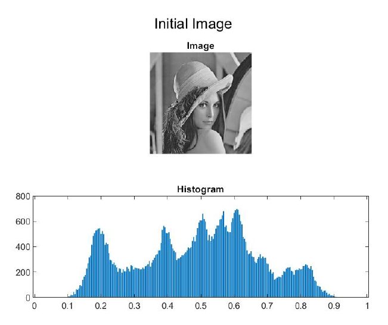
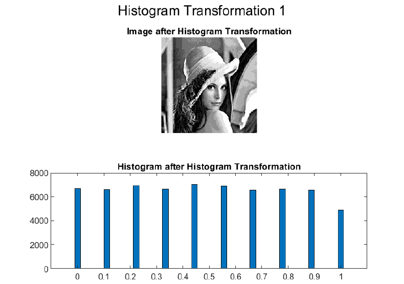
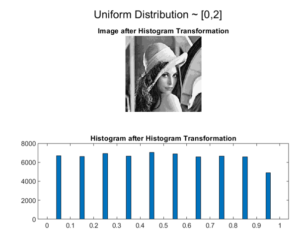
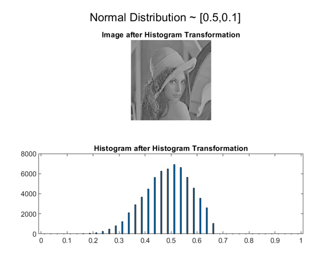

# **Point transformation and Histogram correction**

The purpose of this part of the project is to develop an image processing system in the MATLAB programming environment. Specifically, the system performs point transformation, as well as image histogram correction, to meet specific properties. A detailed description of the developed code will follow, as well as a presentation of the results, both in the form of a final image and a histogram. The original monochrome image, normalized to interval [0,1], which will form the basis of the calculations analyzed, is shown in the figure below along with its luminosity histogram.

## Point transformation

In this initial section the development of a function Y = pointtransform (X, x1, y1, x2, y2) is requested, which takes a monochrome image X and transforms it into the output image Y, based on the transformations of the following figure. 

The function uses an if-else decision structure to determine which branch of the function the pixel in the input image belongs to. Based on the space to which it belongs, it calculates the type of function in the specific space, through the slope and the displacement. Thus, the value for the corresponding pixel of the output image is generated. Below is the output image and its histogram for two transformations. The first uses the values [x1, y1, x2, y2] = [0.1961, 0.0392, 0.8039, 0.9608], while the second is a binary transformation with values [x1, y1, x2, y2] = [0.5, 0, 0.5, 1].

## Histogram based transformation

At this point, the image is transformed so that the resulting histogram covers specific properties. Specifically, the construction of the function Y = histtransform (X, h, v) is required, which transforms the input image X into the output image Y, so that the histogram of Y approaches that described by h and v. V contains in ascending order the brightness values contained by Y, while h contains the percentage of pixels for each brightness value. First, a for is created that scans the vector of the percentages of the luminance values h. Within this a while is created with the control condition. In each iteration within this structure is founded the minimum value of input table X. Then the indicators of all the elements that have this minimum value are searched. For each of these elements, set the corresponding pixel of the output image Y equal to v (1) and then all the elements of the input image X that had this minimum value are set to 1.1, so that in the next iteration the next smallest value will be found. A counter counts how many points are assigned to class v (1). When their percentage becomes equal or exceeds the desired value h (1), we start to place pixels in the next class v (2). This process happens repeatedly until all the pixels of the original image are matched to a class. So when all the pixels are set to 1.1 we exit the iteration structure. The operation control of this function is done by implementing three scenarios.

1. ​	v = [0 0.1111 0.2222 0.3333 0.4444 0.5556 0.6667 0.7778 0.8889 1.0000]
​	h = [0.1000 0.1000 0.1000 0.1000 0.1000 0.1000 0.1000 0.1000 0.1000 0.1000]

1. ​    v = [0 0.0526 0.1053 0.1579 0.2105 0.2632 0.3158 0.3684 0.4211 0.4737 0.5263 … 1]
  ​    h = [0.0500 0.0500 0.0500 0.0500 0.0500 0.0500 0.0500 0.0500 0.0500 0.0500 … 0.0500]

  

  
  

1. ​    v = [0 0.0526 0.1053 0.1579 0.2105 0.2632 0.3158 0.3684 0.4211 0.4737 0.5263 … 1]
  ​    h = [0.0500 0.0500 0.0500 0.0500 0.0500 0.0500 0.0500 0.0500 0.0500 0.0500 … 0.0500]

## Histogram estimation by distribution

What is required here is the implementation of the function h = pdf2hist (d, f), which, given a probability distribution f and a vector d of length 𝑛 + 1, denoting n continuous intervals, produces the values of a histogram h at the given intervals. First, the integral f is calculated at each of the intervals, using Simpson’s Rule numerical integration methods, and is set as the value of the histogram h (i). The vector h is then normalized by dividing each of its elements by the sum of its values, so that the new vector is summed by element to 1.

## Transformation based on probability density

In this query, the previous functions are used to obtain an image whose histogram approximates certain distributions. Emphasis will be placed on the effect of selecting the intervals defined by the vector d, in the form of the final image. 4 different vectors d will be examined. In each case a vector v will be calculated, which will contain the centers of the intervals defined by d, ie the values of the output image.
The distributions under examination are as follows:

1. Uniform distribution in [0, 1]
2. Uniform distribution in [0, 2]
3. Normal distribution with mean value 0.5 and standard deviation 0.1

These functions are constructed via function handle (@) easily using ready-made unifpdf and normpdf functions.
Initially, the function h = pdf2hist (d, f) is called to calculate the values of the histogram h for each distribution. Based on these values and the calculated vector v is called Y = histtransform (X, h, v), to calculate the output image. The luminosity histogram is displayed from it (using the vector v as an argument each time, since these values are taken by the output image). In addition, the error from the ideal histogram required in each case is calculated as the root of the sum of the squares of the differences between the frequencies of the ideal histogram, as calculated by pdf2hist and the (normalized) frequencies of the output image values, as extracted by command hist.

#### 1st Scenario: d = linspace(0, 1, 11) 

#### 2nd Scenario: d = linspace(0, 1, 16) 

#### 3rd Scenario: d = linspace(0, 1, 21) 

#### 4th Scenario: d = linspace(0, 1, 41) 

## Errors

The following table summarizes the errors from the ideal histogram that occurred in the execution of each scenario.

|                       | Scenario 1 | Scenario 2 | Scenario 3 | Scenario 4 |
| :-------------------: | :--------: | :--------: | :--------: | :--------: |
|   **Uniform (0,1)**   |  *0.0276*  |  *0.0499*  |  *0.0557*  |  *0.0606*  |
|   **Uniform (0,2)**   |  *0.0276*  |  *0.0499*  |  *0.0557*  |  *0.0606*  |
| **Normal (0.5, 0.1)** |  *0.0135*  |  *0.0137*  |  *0.0212*  |  *0.0286*  |

## Conclusion

A first conclusion observed from the study of the output images and their histograms is that the results are the same for the two uniform distributions. This is due to the normalization of frequencies in the pdf2hist function.
In addition, however, it is observed that the shape of the completion intervals d, affects the variety of values that the output image can get, as well as the error from the ideal histogram. In particular, as d sets longer intervals, the pixels of the output image may take longer, but the error tends to increase. This second conclusion is due to the impossibility of respectful reproduction of the requested ideal histogram. Because many output image value classes contain more pixels than required, some large value classes (bottom up) are left without any pixels. So some large values are lost from the output image. It could be concluded that the best effort was the one with the 20 completion intervals, because after that the last class begins to be "lost".

