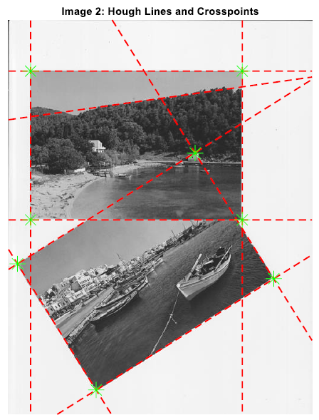

# Hough Transformation & Harris Corner Detection

The reference point of this work is the Hough transform, the Harris Corner Detection process, the rotation and cropping of an image, without the use of built-in MATLAB functions. Initially, a toolbox will be built, which will then be used to solve a real problem of recognizing and cropping images, randomly placed on the surface of a scanner.

## Hough Transform

The first implementation concerns the construction of a function [H, L, res] = myHoughTransform (img_binary, Drho, Dtheta, n), which takes as input the binary image of a ready edge detector for a grayscale image, the Drho resolution for the variable ρ in the Hough field in pixels and the Dtheta resolution of θ in the Hough field in rads. The function returns the transformation table H, the table L with the parameters rho and theta of the n strongest lines and the number res of the points of the input image that do not belong to these n lines.
The proper operation of the function is demonstrated with the script deliverable_1.m. Specifically, the image im2.jpg is given as input and the transformation table H and is displayed with its n vertices marked, as well as the n strongest lines found in the original input image. Initially, the image is read, converted to grayscale, resized to 10% of original size for computational complexity, and doubled to interval [0,1]. Next, I use the **Canny Edge Detector** with threshold [0.32 0.35]. This means that edges with a strength less than the lowest threshold are discarded, while edges with a strength greater than the highest threshold are retained. The choice of method and thresholds was made by experimental tests, in order to obtain the outer edges of the two photos. Next, the arguments of the function are set as Drho = 1, Dtheta = 1 and n = 9 and the constructed function is called. Based on the returned table L, the strongest lines in the input image are plotted. Thus, for an angle θ, so that sinθ = 0, we refer to a vertical edge. The representation of the lines is done with the line function and two points of the specific line. Thus, the two extreme points of the image are given for the line x = ρ. In any other general case the equation of the line is in Cartesian coordinates.

Solving the relation 𝒙𝐜𝐨𝐬 (𝜽) + 𝒚𝐬𝐢𝐧 (𝜽) = 𝝆 with respect to y we have: 𝒚 = (𝝆 − 𝒙 𝒄𝒐𝒔 (𝜽)) / 𝐬𝐢𝐧 (𝜽). The width of the image with a resolution of 1: x = 1: 1: size (I, 2) is used as a vector x.
In regards of **myHoughtransform** function, the vectors theta and rho are first created, where, 𝜌∈ [0, √𝛮12 + 𝛮22] and 𝜃 ∈ [0,2𝜋]. The resolution of θ is converted from 1 degree to 2π / 180 rads. Then for each non-zero element of the binary image, all the lines passing through it are calculated. This is done by going through the theta vector and calculating each time the corresponding ρ from the relation: 𝑥cos (𝜃) + 𝑦sin (𝜃) = 𝜌, where x is the column of the corresponding pixel and y is its line. Thus, if p is found such that it is within the interval rho (i), rho (i + 1), a unit is added to the corresponding element in table H.

The next step is to find the maxima of table H. Since it will be processed, it is advisable to make a copy of it, so the next steps will be done on it. First the maximum of table H is found and the coordinates of this point are searched. When the appropriate point is found, all the elements that have been added so far to L are searched and the check is made, if the new line that will be added looks like a previous one. This is done through the difference of their ρ and θ. Specifically, **if a previous line is found with ρ that is less than 5 and θ that is less than 3, then the two lines are considered to be the same line and the specific maximum becomes -1, so that it is not found again**. At the end of this procedure, if no similar line is found, the parameters ρ and θ of the new line are placed in table L, and the specified maximum becomes -1 again. At this point, the edges are filtered to avoid the border edges of the contour. Thus only the lines with ρ > 2 are kept.

The last step in the process is to find the number of res points, which do not belong to the n lines found. For this purpose, a LinesTable table is created, initialized with zeros, the same size as the image. The table is completed with the image points that belong to the detected images. This procedure scans the lines stored in Table L as follows: First, it checks if it is a vertical line. If yes, to all the pixels belonging to this line add 1. Otherwise find the equation of the line as described and produce the vector y through the horizontal vector: x = 1: 1: size (I, 2). Then for all the elements of y, so that the pixel (y, x) belongs within the limits of the image, 1 is added to the cells of the table (round (y (k)), x (k)). The end result is an image with 1 in each pixel through which one edge passes and 2 at the intersection points of two lines. The number of res is the number of inactive points, ie the number of zeros.

The following is the output of the **edge detector**, the **H transformation table** with the n vertices located, as well as the **lines found on the original image**:

## Harris Corner Detector

This section will implement the Harris Corner Detector algorithm for finding the **corner points** of the image. Specifically, the function corners = myDetectHarrisFeatures (I) will be implemented, which, given a grayscale input image with values in the space [0,1], will return the coordinates of the detected angles.

At this point the function of the myDetectHarrisFeatures function will be analyzed. Initially the Gaussian 3x3 filter w is created. The horizontal and vertical output filter are then created with the Sobel approach. The derivative of the image in the horizontal direction Ix is calculated by the convolution with the horizontal filter with the function imfiter and the argument ‘conv’, while the derivative of the image in the vertical direction Iy is calculated by the convolution with the vertical filter. At this point the sub-tables of table M are calculated as a sum of 𝐼𝑥2, 𝐼𝑦2 𝜅𝛼𝜄 𝐼𝑥 ∗ 𝐼𝑦 with the Gaussian mask w

The next step is to calculate a corner metric for each individual pixel 𝑹 (𝒑𝟏, 𝒑𝟐) = 𝐝𝐞𝐭 (𝑴 (𝒑𝟏, 𝒑𝟐)) - 𝒌 ∗ 𝑻𝒓𝒂𝒄𝒆 (𝑴 (𝒑𝟏, 𝒑𝟐)) 𝟐. An array is initialized with zeros and then for each pixel (except the extremes we are not interested in) array M is calculated, based on the sub-arrays previously calculated. An array M 2x2 is obtained, through which the metric R is calculated. If the result is greater than one threshold, it is stored in the corresponding cell of the initially zero array.

Because high corner values are detected near an angle in all adjacent pixels, it is advisable to keep only one of them. For this purpose a search window equal to 4 pixels in each direction is set. For each non-zero element of the previous angleMetric table, a search is made in radius 4 in each direction if there is another non-zero element. If not, the specific pixel expressing an angle value is added to the detected angles, otherwise it is ignored. Finally, the find function is used to find the coordinates of the non-zero cells in the filteredCorners table. The coordinates are stored in the two-dimensional array of corners in [column, row] format.

The script deliverable_2.m was written to demonstrate the function of the function. Based on this script, the input image is loaded and converted to grayscale. The functions myDetectHarrisFeatures and detectHarrisFeatures are then called, to compare the method implemented with the built-in MATLAB algorithm. Obviously, the result of the myDetectHarrisFeatures function depends on the choice of k and threshold parameters. After experimental procedures these values were set as k = 0.06 and threshold = 1, in order to achieve the same number of angles with the ready MATLAB function. The results for the two algorithms are presented below. It is obvious that the algorithms do not detect exactly the same corners, however the results are similar to a satisfactory degree.

## Rotation

The toolbox is completed with the anti-clockwise image rotation function in degrees. Specifically, the function rotImg = myImgRotation (img, angle) is constructed, which takes as input an image (grayscale or RGB) and the angle of rotation in rads. The output is the rotated image, with dimensions capable of accommodating the entire image.

The function starts the calculations with the diagonal of the image. The goal is to expand the dimensions of the original image to fit any rotation. This is done by adding to the dimensions the difference of the diagonal from the original dimensions. This results in a square image 835x835, equal to the size of the diagonal, which is called an imagepad. The original input image is placed in the center of this image.

Then the coordinates of the center of this image are found and one is initialized image with zeros (imagerot) that will be the inverted image. The general idea is finding the match of each pixel of imagerot with a pixel of imagepad. For the purpose, a Rotation Matrix will be used.

The x symbolizes the columns of the imagepad, while the y symbolizes its rows. As reference point is considered the middle of the image (midRows, midCols), therefore the coordinates will be subtracted from their corresponding imagerot pixel coordinates before the transformation and will be added to the pixel of the imagepad after finding the match. The last step is the bilinear interpolation. After a check that it was not found edge pixel of imagepad, the calculation of imagerot pixel will take place based on the four adjacent pixel of the corresponding pixel of the imagepad.

The demonstration of the correct operation of the function is done through the execution of the script deliverable_3.m. Specifically the image im2.jpg is loaded and converted to double in the interval [0,1], while then it is given as input to the function. The script rotates the image 54º and 213º counterclockwise. The results for the RGB input image are presented below. It should be noted that the algorithm works just as well for a grayscale image.

## Lazy Scanner

In the second part of the project, we are called to solve the problem of recognizing images that were erratically placed on the surface of a scanner, cutting them and saving them in separate files. The script to be analyzed works without prior knowledge of the number of images to be detected.

At this point it is worth mentioning that many ways have been tried to implement this process. In each case all methods attempted to locate the 4 corners for each image. Initially the problem was approached by filtering the Harris Corners corners. A method was developed that required the located corners to be "close" in white background color to each direction. So I managed to isolate for each image 4 angles that describe it. However, this method had two major drawbacks. First in the case of im2.jpg it was impossible to locate the "hidden" corner. Second, isolating the 4 strong angles for each image was a configured process that required different thresholds for each case.

For this reason a more general method was followed. The images were located by finding the orthogonal intersections between the located Hough lines. Although the method I implemented works well for 3 of the 5 images, unfortunately it can not be considered a general method, as it does not work for all. Although the following method works for im1.jpg, im2.jpg and im4.jpg, it does not work for im3.jpg (because there are orthogonal points that do not correspond to an corner) and im5.jpg (because it cannot detect one of the edges of the upper image with the edge detector). The procedure followed concerns the script myLazyScanner.m and is described below:

Initially the desired input image is loaded, converted to grayscale, resized to 10% and doubled to interval [0,1]. This image is given to a **Canny edge detector** with threshold [0.32, 0.36] to produce the binary edge image. The following are the parameters that will be used as inputs to the myHoughTransform.m function (Drho = 1, Dtheta = 1, n = 10), as well as the minimum distance that two adjacent corners must have in order to be considered different angles (maxDist = 20). The localized edges are displayed on the input image in the way already analyzed.

## Orthogonal Intersections

The key point of the process is to find these lines that form a right (or almost right) angle with each other. This initializes an empty vector crosspoints, which will be completed with the coordinates of the orthogonal angles. Going through the table L look for **lines that intersect orthogonally** with the condition **abs (cos (L (i (2) - L (j, 2))) < 0.1**. As is well known, the 90 degree cosine is equal to zero. So if such a pair of lines is found, it remains to find their intersection point. This is done by finding the equations of the lines y1 (x) and y2 (x), where x is a vector x = 1: 1: size (I, 2) in the horizontal direction of the image. The point of intersection is located through the minimum distance of the vectors y1, y2.

However, if one of the two lines is the vertical line, its equation cannot be calculated. In this case the equation of the second line is calculated (horizontally) and the point corresponding to **x = r = L (i, 1)** is obtained. Similar is the procedure in the case where the line j is vertical.

The next step is to "filter" the corners found. This procedure is intended to discard near corners in the case of, for example, Figure 1, where close points of rectangle are formed. Thus a point is considered as an angle and is added to an initially empty table, only if no other point in a radius smaller than a maxDist parameter has been added so far. The remaining points are depicted on the original image with its edges. Note that for im4.jpg the parameter n was set to 8, while the maxDist parameter was set to 1, as there are close corners that need to be detected.

## Cropping

At this point the images will be cut based on the angles found. Firstly, the number of images has to be calculated, which will be done by dividing the number of angles by 4, since as is well known each image has 4 angles. Then the table of angles found will be sorted based on its element's line. In addition, a UsedCorners vector is initialized, equal in number to the number of angles with zeros. When one of the detected angles is used as the cut-off point, 1 will be placed in the corresponding position of the vector, so that the specific point will not be reused.

Entering an iterative structure for the number of images to be cut, the first two unused points are searched based on the UsedCorners vector. The first to be found is set as corner1 and the second as corner2. In case corner1 is to the right of corner2, these two points are swapped as shown below.

Then the coordinates x (column), y (row) are obtained for these two points and the slope of the line joining them through the inverse tangent is calculated. From this point on, a pair of points in the SortedCorners table are searched for, so that the line between them has a slope similar to that calculated. So if two next points are found, which have the same slope (**abs (myAngle2 - myAngle) <= 0.015**) and are unused (**UsedCorner (i) == 0 && UsedCorner (j) == 0**), then they are located as corner3 and corner4 and the corresponding UsedCorner positions become 1. A swapping also occurs in this case so that corner4 is always the rightmost element.

Before making any cropping, the original image must be oriented properly so that the cropped image is horizontal. So if the calculated slope (myAngle) is greater than some rads (0.02), the image is rotated counterclockwise at the same angle, via the myImgRotation function and along with it the coordinates of the detected corners are rotated to be compatible with the new image .

Particular attention must be paid to the transformation of the coordinates of the angles to be compatible with the new image. First of all, we must not forget that the rotated image is a larger image than the original. Therefore the pad must be added, ie the difference of the dimensions of the inverted and the initial one divided by two in the column and in the line of each corner. Next, the center of the rotImg rotated image is founded and the coordinates are rotated around it as described in the myImgRotation function. The SortedCorners table now stores the coordinates for the rotated image. Finally, the orthogonal points appear in the rotated image. If the image is already almost horizontal, no rotation is made.

The last stage is the crop. This will be done with the built-in MATLAB imcrop function, which uses its upper left and lower right coordinates, ie corner1 and corner4.

The function is called with the first argument the input image (rotated or not) and with the second argument a 4-position vector, where in the first position is the intersection (column) of corner1, in the second position is the ordinate (line) of corner1, in the third position is the width of the quadrilateral and in the fourth position is the height of the quadrilateral.

## Results

The following are the results of the process for **im1.jpg, im2.jpg and im4.jpg**. As already mentioned, the parameters for the first two were set 𝑛 = 10, 𝑚𝑎𝑥𝐷𝑖𝑠𝑡 = 20, while for the last 𝑛 = 8, 𝑚𝑎𝑥𝐷𝑖𝑠𝑡 = 1.

#### img1.jpg

#### img2.jpg

#### im4.jpg

